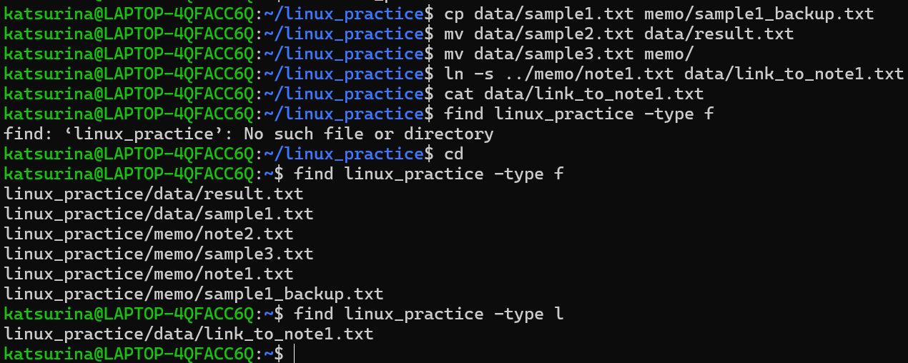
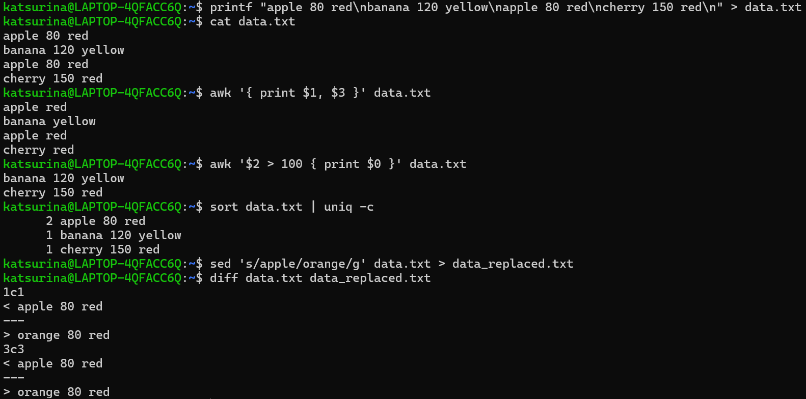

# 第2回課題

## 課題1: ファイルとディレクトリの作成


```
$ mkdir -p parent/child/grandchild/...    # 再帰的にディレクトリを作成
$ touch newfile1.txt newfile2.txt ...     # 空ファイルの作成
$ cd ..                                   # 親ディレクトリへ移動
$ cd parent/child/grandchild/...          # ディレクトリ移動
```
資料では`$ cd /parent/child/grandchild/...`となっていましたが、上のが正しく動きました


```
$ ls -R linux_practice                    # 再帰的にサブディレクトリも表示
```

## 課題2: ファイルのコピー・移動・名前変更・検索



```
$ cp dir1/old.txt dir2/new.txt            # dir1/old.txt を dir2/new.txt にコピー
$ mv old.txt new.txt                      # old.txt を new.txt に名前変更
$ dir1/file.txt dir2/                     # dir1/file.txt を dir2/file.txt に移動
$ ln -s ../dir1/file.txt dir2/link_to_file.txt    # ショートカットの作成
```
シンボリックリンクでは相対パスを用いた

## 課題3: テキストファイルの作成・置換・比較・集計



- `awk`: テキストファイルを行単位で読み込み、フィールド（列、デフォルトはスペースやタブ区切り）ごとに分割して処理を行う。特定のパターンにマッチした行に対して、指定したアクションを実行できる。
- `sort`: テキストファイルの行を並べ替える。
- `uniq`: 連続する重複行を削除する。
- `sed`: 正規表現の要素ごとに置換できる。
- `diff`: 2つのファイルの差分を表示する。

## 課題4: 不可視文字のセキュリティリスク

　Unicodeの不可視文字（ゼロ幅スペースや異体字セレクターなど）は、画面上ではほとんど表示されないため、一般的な表示では存在に気付きにくい特徴がある。攻撃者はこの性質を悪用し、一見正常に見えるソースコードの中へ悪意ある処理を隠し、開発者に気付かれないままマルウェアを混入させる「GlassWorm」のようなサプライチェーン攻撃を行う。そのため、見た目だけでコードを信用せず、バイト列やUnicode文字を表示できるツール（`od`、`hexdump`など）で確認したり、CIに不可視文字検出ツールを組み込んだり、信頼できるソースから取得したコードのみを利用するなどの対策が重要。

参考2026/07/06: https://www.linuxmaster.jp/linux_blog/2026/04/githubglasswormlinuxoss.html

