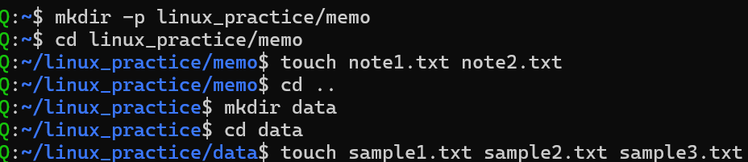
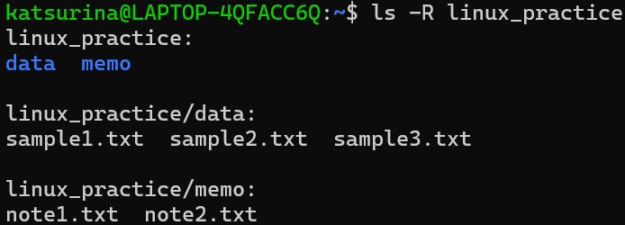

# 第1回課題

## 課題1: ファイルとディレクトリの作成

- `mkdir -p parent/child/grandchild/...`: 再帰的にディレクトリを作成
- `touch newfile1.txt newfile2.txt ...`: 空ファイルの作成
- `cd ..`: 親ディレクトリへ移動
- `cd parent/child/grandchild/...`: ディレクトリ移動
資料では`cd /parent/child/grandchild/...`となっていましたが、上のが正しく動きました。

- `ls -R linux_practice`: 再帰的にサブディレクトリも表示

## 課題2: ファイルのコピー・移動・名前変更・検索

